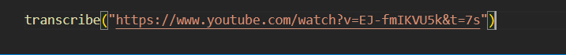
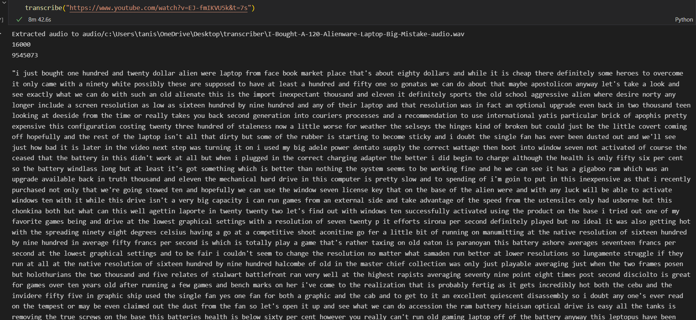
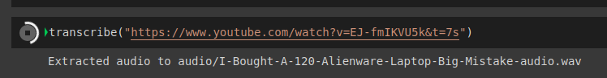
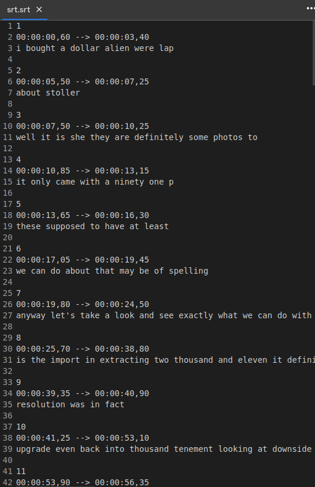

# transcribing using deepspeech

The following program transcribes video from YouTube using Mozilla's
deepspeech model.


## Deployment

To deploy this project run, you should have following dependencies:

1. deepspeech

```bash
  pip install deepspeech
```
a. Download the pre-trained model and the scorer file for higher accuracy.

For Windows:
```bash
    curl -LO https://github.com/mozilla/DeepSpeech/releases/download/v0.9.3/deepspeech-0.9.3-models.pbmm
    curl -LO https://github.com/mozilla/DeepSpeech/releases/download/v0.9.3/deepspeech-0.9.3-models.scorer
```

For linux:
```bash
    wget https://github.com/mozilla/DeepSpeech/releases/download/v0.9.3/deepspeech-0.9.3-models.pbmm
    wget https://github.com/mozilla/DeepSpeech/releases/download/v0.9.3/deepspeech-0.9.3-models.scorer
```
2. pytube
```bash
  pip install pytube
```
3. tensorflow
Since the deepspeech model is trained using tensorflow, it is required to run the project

```bash
    pip install tensorflow
```
## Transcribing the video

1. Go to the video you want to transcribe and copy it's link


2. Call the transcribe function by pasting the url in it.


3. Be patient because it is a computationally intensive task. Usually the time taken to transcribe is equivalent to the length of the video.


## Update
## Getting an SRT output

1. Open transcriber_(srt_output).ipynb
2. Enter the link of the video you want to transcribe.

3. You'll get the srt file in your environment.

